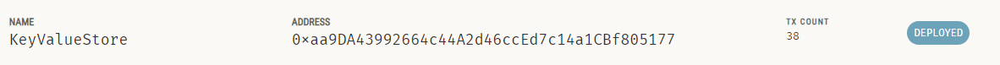

# Arke command line chatting application

## Getting started (Local test)
### Setup ganache
1. Clone the project
2. Install ganache from [https://trufflesuite.com/ganache/](https://trufflesuite.com/ganache/)
3. Start new workspace in ganache 
   
4. Add project with the path arke_application\store\truffle-config.js
5. Set the server with <br/>
    HOSTNAME: 127.0.0.1 <br/>
    PORT NUMBER: 9545 <br/>
    NETWORK ID: 5777 <br/>
    
6. Install truffle from [https://trufflesuite.com/docs/truffle/how-to/install/](https://trufflesuite.com/docs/truffle/how-to/install/)
7. In a command prompt, Navigate to store folder and deploy the Ethereum contract of key-value store with the commands below:
   ```sh
   truffle develop
   compile
   migrate
   ```
   Ganache should show that the contract is deployed now.
8. Keep ganache running

### Setup for testing the application
1. Navigate to the client folder, update the contract address on line 70 of the file main_menu_option1.rs to the deployed contract address as shown on ganache. Also update the contract address on line 41 of the file main_menu_option3.rs to the same deployed contract address.
   
2. Duplicate the client folder to simulate two users.
3. In a command prompt, Navigate to client folder and start client for user1 with the command below:
   ```sh
   cargo run --release
   ```
4. In another command prompt, Navigate to the copied client folder and start client for user2 with the command below:
   ```sh
   cargo run --release
   ```
5. In another command prompt, Navigate to server folder and start server with the command below:
   ```sh
   cargo run --release
   ```

### Testing the application

1. In the first runs for both clients, select "My Info" from the main menu to fill the personal information of the users. Give different nicknames and eth addresses for two users. Eth addresses can be selected from the account address provided in the previously setup ganache workspace.
2. For user1, select "Contact Discovery" from the main menu to search user2 by the nickname and add user2 to the contact book. For user2, select "Contact Discovery" from the main menu to search user1 by the nickname and add user1 to the contact book. Contact discovery takes a long time even in release mode due to client deserializing setup details such as pp_zk from the server.
3. After contact discovery finished for both users, for each user, select "Contacts" from the main menu to verify that the discovered user is added to the contact book.
4. Both users select each other in the contact book to start chatting.
5. Type in any message to chat.